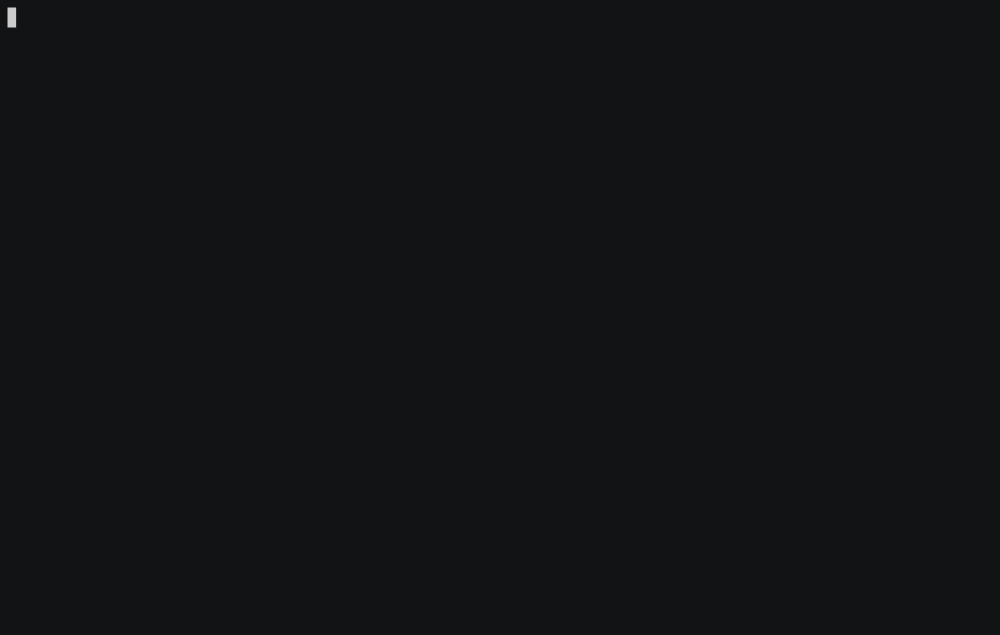

# Kaf
Kafka CLI inspired by kubectl & docker

[](https://github.com/birdayz/kaf/actions)
[](https://goreportcard.com/report/github.com/birdayz/kaf)
[](https://godoc.org/github.com/birdayz/kaf)



## Install
Install from source:

```
go get github.com/birdayz/kaf/cmd/kaf
```

Install binary:

```
curl https://raw.githubusercontent.com/birdayz/kaf/master/godownloader.sh | BINDIR=$HOME/bin bash
```


## Configuration
See the [examples](examples) folder

## Shell autocompletion
Source the completion script in your shell commands file:

Bash

```echo 'source <(kaf completion bash)' >> ~/.bashrc```

Zsh

```echo 'source <(kaf completion zsh)' >> ~/.zshrc```
